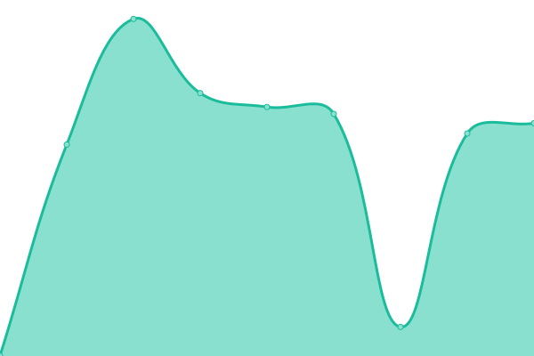

# [📈 Live Status](https://IPMGroupLtd.github.io/Uptime): <!--live status--> **🟩 All systems operational**

This repository contains the open-source uptime monitor and status page for [Inteligent Protection Management Ltd](https://IPMGroupLtd.github.io/Uptime), powered by [Upptime](https://github.com/upptime/upptime).

With [Upptime](https://upptime.js.org), you can get your own unlimited and free uptime monitor and status page, powered entirely by a GitHub repository. We use [Issues](https://github.com/IPMGroupLtd/Uptime/issues) as incident reports, [Actions](https://github.com/IPMGroupLtd/Uptime/actions) as uptime monitors, and [Pages](https://IPMGroupLtd.github.io/Uptime) for the status page.

<!--start: status pages-->
<!-- This summary is generated by Upptime (https://github.com/upptime/upptime) -->
<!-- Do not edit this manually, your changes will be overwritten -->
<!-- prettier-ignore -->
| URL | Status | History | Response Time | Uptime |
| --- | ------ | ------- | ------------- | ------ |
|  [Main](https://ipmgroupuk.com) | 🟩 Up | [main.yml](https://github.com/IPMGroupLtd/Uptime/commits/HEAD/history/main.yml) | 

 1642ms
     
 | 

<a href="https://status.teamhub.pro/history/main">97.90%</a>
    

|  [TeamHub](https://teamhub.pro) | 🟩 Up | [team-hub.yml](https://github.com/IPMGroupLtd/Uptime/commits/HEAD/history/team-hub.yml) | 

 683ms
     
 | 

<a href="https://status.teamhub.pro/history/team-hub">100.00%</a>
    

|  [Live](http://live.teamhub.pro/swagger) | 🟩 Up | [live.yml](https://github.com/IPMGroupLtd/Uptime/commits/HEAD/history/live.yml) | 

 373ms
     
 | 

<a href="https://status.teamhub.pro/history/live">100.00%</a>
    

|  [Immix](https://ipm.immixcs.net) | 🟩 Up | [immix.yml](https://github.com/IPMGroupLtd/Uptime/commits/HEAD/history/immix.yml) | 

 517ms
     
 | 

<a href="https://status.teamhub.pro/history/immix">100.00%</a>
    

|  [Intelipod Cloud Dashboard](https://dash.intelipodcloud.co.uk) | 🟩 Up | [intelipod-cloud-dashboard.yml](https://github.com/IPMGroupLtd/Uptime/commits/HEAD/history/intelipod-cloud-dashboard.yml) | 

 783ms
     
 | 

<a href="https://status.teamhub.pro/history/intelipod-cloud-dashboard">100.00%</a>
    

|  [Training Site](https://training.teamhub.pro) | 🟩 Up | [training-site.yml](https://github.com/IPMGroupLtd/Uptime/commits/HEAD/history/training-site.yml) | 

 618ms
     
 | 

<a href="https://status.teamhub.pro/history/training-site">100.00%</a>
    

<!--end: status pages-->

[**Visit our status website →**](https://IPMGroupLtd.github.io/Uptime)

## 📄 License

- Powered by: [Upptime](https://github.com/upptime/upptime)
- Code: [MIT](./LICENSE) © [Inteligent Protection Management Ltd](https://IPMGroupLtd.github.io/Uptime)
- Data in the `./history` directory: [Open Database License](https://opendatacommons.org/licenses/odbl/1-0/)
